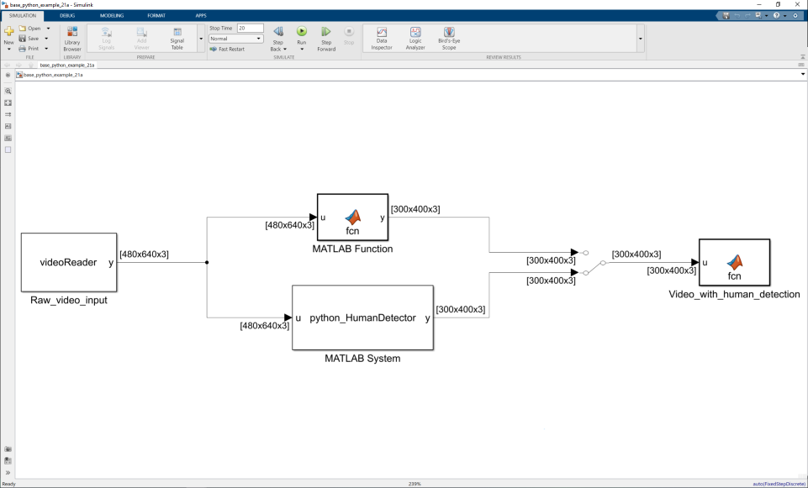

# Integrate Python Code into Simulink for Simulation 

[](https://matlab.mathworks.com/open/github/v1?repo=yanndebray/Integrate_Python_code_with_Simulink&project=pySimCV.prj&file=README.mlx)

📹 Integrate OpenCV into Simulink models through Python wrapper: 
Simulation of a Human Detection Algorithm


```matlab
open_system("base_python_example_23a.slx")
```

This example shows users how to integrate Python Human detection code into Simulink for simulation. This example reads a pre-recorded video, apply the human detection algorithm defined in Python and generate the outpur video with human marked. This example includes the following files:

 * [runme.m](runme.m): This file provides the prep steps when using this example. Since the Python algorithm is based on OpenCV, you will need install the needed packages if they are not available on your computer. This file also helps set the "out of Process" execution mode to avoid possible MATLAB crashes. And it will also set the Python path to the current folder.  

* [setup_python.m](setup_python.m): This script retrieves the necessary Python packages automatically to enable this demo in MATLAB Online.

* [detectHuman.py](detectHuman.py): this file contains the Python algorithm using OpenCV Histogram of Oriented Gradients (HOG) for human detection. 

* [livedata.mp4](livedata.mp4): this file is a pre-recorded video showing several people walking.  

* [python_HumanDetector.m](python_HumanDetector.m): this file contains the MATLAB System Object integrating the Python human detection algorithm.

* [videoReader.m](videoReader.m): this file contains the MATLAB System Object reading the pre-recorded video of livedata.mp4. This can be replaced if you have DSP System Toolbox available.
(If you have DSP System Toolbox available, you could use the "From Multimedia File" block to replace the videoReader System block for simpler video reading; If you have Computer Vision Toolbox available, you can use the "To video Display" block to replace the Video_with_human_detection MATLAB function block for simpler video play.)

* [base_python_example_21a.slx](base_python_example_21a.slx): this file shows how Simulink can integrate Python code for simulation by using either MATLAB Function block or MATLAB System block. You could use the manual switch to select either method to bring in Python code. When you run this file, the output video will show blue boxes drawn around detected people.  
    



## How to

To use this example, 
1. open and run the runme.m first in MATLAB; 
2. Then start the base_python_example_23a.slx 
3. Run simulation.   


## Product dependencies
Products needed for using this example :

* MATLAB; 
* Simulink; 
* DSP System Toolbox (optional); 
* Computer Vision Toolbox (optional);

&reg; 2021-2024 The MathWorks, Inc.
